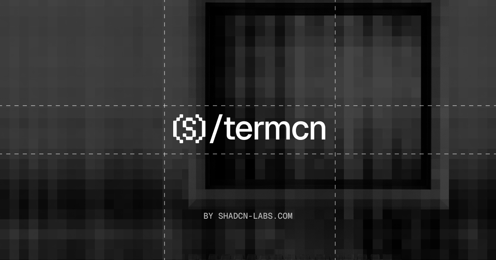

  

<h1 align="center">termcn</h1>

  <a href="../../README.md">English</a> · <a href="README.ja.md">日本語</a> · <a href="README.ko.md">한국어</a> · <a href="README.es.md">Español</a> · <a href="README.fr.md">Français</a> · <a href="README.pt.md">Português</a>

  免费开源、开箱即用、可自定义的 React 终端 UI 组件。 
  零配置。一条命令完成安装。基于 <a href="https://github.com/vadimdemedes/ink">Ink</a> 和 <a href="https://github.com/anomalyco/opentui">OpenTUI</a> 构建，与 <a href="https://ui.shadcn.com/">shadcn/ui</a> 无缝协作。

  
  
  
  

  <a href="https://termcn.dev/docs">快速开始</a> ·
  <a href="https://termcn.dev/docs/installation">安装</a> ·
  <a href="https://termcn.dev/docs/components">组件</a>

## 特性

- 🎨 **主题感知** — 自动适配你所选择的终端主题
- 🎯 **零配置** — 开箱即用，提供合理的默认值
- 📦 **兼容 shadcn/ui** — 使用相同的注册表格式和 CLI
- ⌨️ **由 Ink 和 OpenTUI 驱动** — 完整使用强大的终端渲染能力
- 🧩 **可组合** — 使用简单的声明式组件构建复杂的终端 UI
- 📊 **图表与数据** — 柱状图、折线图、仪表盘、热力图等
- 🤖 **AI 组件** — 聊天消息、工具审批、流式文本和思考块
- 🎮 **导航** — 命令面板、标签页、菜单、侧边栏和分页

## 社区

termcn 社区活跃在 [GitHub](https://github.com/shadcn-labs/termcn)，你可以在这里提问、分享想法，并展示你的作品。

## 贡献

欢迎贡献代码。请参阅 [CONTRIBUTING.md](../../CONTRIBUTING.md) 了解如何在本地运行仓库并提交更改，并使用 [issues](https://github.com/shadcn-labs/termcn/issues) 和 [discussions](https://github.com/shadcn-labs/termcn/discussions) 进行协作。参与即表示你同意遵守[行为准则](../../CODE_OF_CONDUCT.md)。

## 安全

请不要为安全漏洞创建公开 issue。请遵循 [SECURITY.md](../../SECURITY.md) 并通过 GitHub Security Advisories 私下报告。

## 许可证

[MIT](../../LICENSE)

## 贡献者

> 由 [contrib.rocks](https://contrib.rocks) 制作

## 统计

## Star 历史

<a href="https://www.star-history.com/?repos=shadcn-labs%2Ftermcn&type=date&legend=top-left">
 <picture>
   <source media="(prefers-color-scheme: dark)" srcset="https://api.star-history.com/chart?repos=shadcn-labs/termcn&type=date&theme=dark&legend=top-left&sealed_token=Y57mSprjn7uT0MjlKlSNyToEuYvZHvGxID6vUI9K_VxHA5vfhAINmbTs6nc_cVFLlt0P6GwGz8OJkwYLgsVqmPh2wBoP7wr2lLtQTaRXwdnm6n5eTclAfnbNtdNBGPmtOM1d0p_Dwp9sLRUxK489V0p-zb3lALJLEqde2MhcXciEPUsY8J-VKi28VfFq" />
   <source media="(prefers-color-scheme: light)" srcset="https://api.star-history.com/chart?repos=shadcn-labs/termcn&type=date&legend=top-left&sealed_token=Y57mSprjn7uT0MjlKlSNyToEuYvZHvGxID6vUI9K_VxHA5vfhAINmbTs6nc_cVFLlt0P6GwGz8OJkwYLgsVqmPh2wBoP7wr2lLtQTaRXwdnm6n5eTclAfnbNtdNBGPmtOM1d0p_Dwp9sLRUxK489V0p-zb3lALJLEqde2MhcXciEPUsY8J-VKi28VfFq" />
   
 </picture>
</a>
